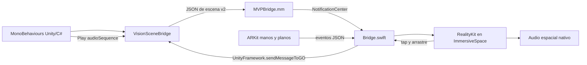

# Arquitectura

**Unity es la fuente de verdad de la lógica.** Cada objeto con `VisionObject` tiene un ID estable, una forma o clave de modelo y un `Transform`. `VisionSceneBridge` envía una instantánea completa 10 veces por segundo. El host crea, actualiza o elimina las entidades RealityKit según esa instantánea.

**Los recursos viajan en el build.** `ExportVisionModels.cs` convierte mallas `MeshFilter` con UV y una textura de color base a USDA; `ExportVisionAudio.cs` copia WAV/AIFF. `BuildVisionExperience.cs` añade los recursos al Xcode exportado y ejecuta `Assets/Editor/VisionHost/integrate_host.rb`. Ese script integra `NativeHost` y aplica los parches de ventana necesarios para que Unity no oculte el espacio inmersivo.

**La entrada vuelve a C#.** Tap llama `VisionObject.Select()`. Arrastre, manos y superficies llegan como eventos tipados de `VisionInput`. El host solicita por separado los permisos de manos y entorno. Unity decide qué hacer con cada muestra; ningún comportamiento de una escena concreta se programa en Swift.

**Límite arquitectónico:** el host Swift contiene implementaciones de capacidades. Si se necesita un nuevo tipo de recurso o evento, habrá que añadirlo allí y documentar el contrato. Crear otra escena con las capacidades ya expuestas requiere solo Unity/C#.
